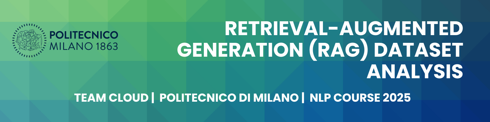

  

## Retrieval-Augmented Generation (RAG) Dataset Analysis

This project was developed for the **Natural Language Processing** course at  
**Politecnico di Milano (PoliMi)** – Spring Semester, 2025.

In this assignment, we explored the **RAG Dataset 12000** from Hugging Face, containing 12,000 question–answer pairs with accompanying context. The answers were automatically generated using GPT-4. We applied various NLP techniques ranging from exploratory analysis to advanced transformer-based modeling.

- 📂 [Main GitHub Repository](https://github.com/SAFUANlip/NLP_project/tree/main)

---
## 📊 Dataset Overview

- **Source**: [Hugging Face – RAG Dataset 12K](https://huggingface.co/datasets/neural-bridge/rag-dataset-12000)
- **Size**: 12,000 samples
- **Each entry contains**:
  - `question`: A user query
  - `context`: A passage retrieved for the question
  - `answer`: GPT-4 generated response

---
## 🧑‍💻 Detailed Summary of My Contributions

---

### 📌 1. Embedding Analysis Notebook (`embedding_analysis.ipynb`)

#### 🧭 Objective:
Explore semantic structures in the RAG dataset using vector representations of context, question, and answer fields.

#### 🔍 Steps Taken:

**Exploratory Data Analysis (EDA):**
- Loaded the RAG 12K dataset
- Cleaned missing values, leaving **9,598 valid rows**
- Explored document length, token distribution, and common patterns in questions and contexts

**Preprocessing Pipeline:**
- Removed emails, URLs, punctuation
- Lowercased text, tokenized using **NLTK**
- Removed stopwords (including a custom list of modal/auxiliary verbs)
- Removed semantically weak number words (e.g., "hundred", "thousand") to improve embedding quality

**Word Embedding Techniques Used:**
- **Word2Vec** (skip-gram or CBOW not specified) trained on preprocessed text
- Visualized word vectors using **t-SNE** (2D reduction)
- Used **cosine similarity** to compare question–context pairs

**Semantic Clustering:**
- Applied **K-Means clustering** to Word2Vec-based document embeddings
- Identified latent topical structure (e.g., medical vs tech vs general queries)

#### 📈 Outcome:
Revealed that semantically similar questions group well in vector space. Preprocessing (custom stopword lists, number filtering) significantly improved embedding space structure.

---

### 📌 2. Summarization Notebook (`summarisation.ipynb`)

#### 🧭 Objective:
Fine-tune a lightweight summarization model to answer questions based on contextual text using a parameter-efficient setup.

#### 🧠 Techniques Used:
- **Model**: `google/flan-t5-base`
- **Fine-tuning Method**: **LoRA** (Low-Rank Adaptation) using Hugging Face's `peft` and `adapter-transformers`

#### 🛠️ Pipeline:

**Instruction-based Prompting:**
- Input: `"summarize: " + question + context`
- Target: GPT-4-generated answer
- Tokenized with padding/truncation

**LoRA Setup:**
- Injected trainable matrices into frozen T5 layers
- Trained only ~0.1% of parameters → efficient for limited compute

**Training:**
- Loaded a filtered subset of the dataset
- Applied preprocessing and tokenization in batches
- Used Hugging Face `Trainer` for training

**Evaluation:**
- Used **ROUGE scores** to assess summary quality
- Performed **qualitative evaluation** of generated summaries vs ground truth

#### 🚀 Outcome:
Successfully adapted FLAN-T5 to generate concise, relevant summaries for QA contexts with **low training cost**. LoRA maintained performance while significantly reducing training time — ideal for domain-specific RAG QA tasks.

---

## 👥 Team Members

- Safuan IUSUPOV
- Shodai FUJIMOTO  
- Dorsa MOTIALLAH
- Darkhan ISLAM
- Hadjer BRIOUA
---

## 🧑‍🏫 Supervision

This project was completed as part of the **Natural Language Processing** course  
at **Politecnico di Milano**, Department of Electronics, Information and Bioengineering (DEIB).

- **Lecturer**: Prof. Mark Carman  
  *Associate Professor, DEIB*
  
- **Lab Instructor**: Nicolò Brunello  
  *PhD Student, DEIB*

---

## 📚 References

- [RAG Dataset 12000 on Hugging Face](https://huggingface.co/datasets/neural-bridge/rag-dataset-12000)
